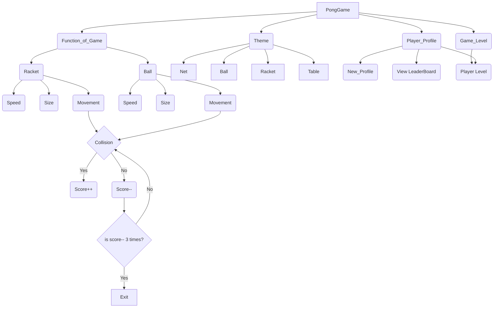

# The Pong Game

```mermaid
graph TD
	A[PongGame] --> B(Function_of_Game)
	A --> C(Theme)
	A --> D(Game_Level)
	A --> E(Player_Profile)

	B --> F(Racket)
	B --> G(Ball)

	F --> XR(Speed)
    F --> YR(Size)
	F --> ZR(Movement)
	
	G --> XB(Speed)
    G --> YB(Size)
    G --> ZB(Movement)

	ZR --> Col{Collision}
	ZB --> Col{Collision}

	Col --> |Yes| S+(Score++)
	Col --> |No| S-(Score--)
	S- --> Chance{is score-- 3 times?}

	Chance --> |Yes| Exit
	Chance --> |No| Col

	C --> Net
	C --> Ball
	C --> Racket
	C --> Table	

	E --> NP(New_Profile)
    E --> VL(View LeaderBoard)

	D --> PL(Player Level)
	E --> PL


	
```
